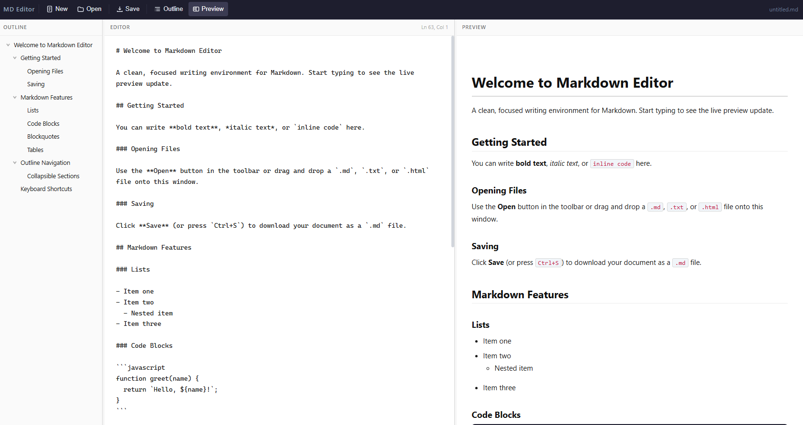

# Markdown Editor

> [!TIP]
> This tool is actively maintained as a private writing utility. Feature requests and bug reports are welcome via GitHub Issues and will be reviewed within 1–3 weeks.

> [!WARNING]
> ⚠️ CAUTION: This repository contains code developed with the assistance of Artificial Intelligence (AI). While functional, AI-generated code can introduce hidden bugs, security vulnerabilities, or logic flaws that may not be immediately apparent. Please thoroughly review, audit, and test all files in an isolated development environment before deployment, as this software is provided as-is and used entirely at your own risk.

## 🚀 Introduction

Markdown Editor is a private, browser-based writing tool built as a single self-contained HTML file — no server, no login, no activity logging, no backend. It runs entirely in the browser with no dependencies beyond jQuery and marked.js loaded from CDN.

The editor is designed around a clean, distraction-free writing experience: write Markdown in the editor pane, see a live rendered preview alongside it, and navigate the document structure through an auto-generated heading outline in the sidebar. Files can be opened by drag-and-drop or file picker and downloaded as `.md` files at any time — no cloud storage, no accounts, full manual control.

It is intended as a compact, focused tool for writing, editing, and previewing Markdown documents entirely within the browser.

---

## 🔥 Features

A focused feature set covering all major aspects of a practical Markdown writing environment with live preview and document navigation.

### ✏️ Markdown Editor

A plain-text editor textarea with monospace font, Tab key support (2-space indent), live cursor position display (line and column), and a debounced rendering pipeline that keeps the preview in sync while typing without lag.

### 👁️ Live Preview

The preview pane renders Markdown to HTML in real time using marked.js with full GFM (GitHub Flavored Markdown) support — including headings, bold, italic, strikethrough, code blocks, blockquotes, tables, and inline HTML. The preview is styled with clean reading typography and does not rely on browser defaults.

### 🗂️ Document Outline

The left sidebar automatically parses all headings (`#` through `######`) from the Markdown source and builds a collapsible hierarchical tree. Each node reflects its heading level through indentation. Clicking a heading in the outline simultaneously scrolls the preview to the corresponding anchor and places the editor cursor on that heading's line.

### 🔀 Collapsible Sidebar & Preview

Both the outline sidebar and the preview pane can be toggled via toolbar buttons. The divider handles between panes are draggable for manual resizing. On smaller screens, panes collapse sensibly to keep the editor usable.

### 📂 File Handling

Open files via the **Open** toolbar button or by dragging and dropping a file directly onto the window — a visual overlay confirms the drop target. Supported formats are `.md`, `.markdown`, `.txt`, `.html`, and `.htm`. The currently loaded filename is displayed in the toolbar.

### 💾 Save / Download

Click **Save** or press `Ctrl+S` to download the current editor content as a `.md` file using the browser's native Blob download. An amber indicator dot appears in the toolbar whenever there are unsaved changes.

### 📊 Status Bar

A status bar at the bottom of the window shows live word count, character count, line count, and heading count, updating continuously as you type.

### ⌨️ Keyboard Shortcuts

| Shortcut | Action |
|---|---|
| `Ctrl+S` | Save / Download |
| `Ctrl+O` | Open file |
| `Ctrl+N` | New document |
| `Tab` | Indent (2 spaces) |

---

## 🗒️ Requirements

No server-side requirements. The editor runs entirely in the browser.

| Requirement | Value |
|---|---|
| Modern Browser (Chrome, Firefox, Edge, Safari) | Required |
| JavaScript enabled | Required |
| Internet connection (CDN for jQuery + marked.js) | Required on first load |
| Screen resolution | 1280×720 minimum recommended |

---

## 🛠️ Usage

### 🌐 GitHub Pages (Recommended)

The editor is hosted via GitHub Pages directly from this repository. No installation required — open the link in any modern browser:

[https://bugfishtm.github.io/js-markdown-editor/](https://bugfishtm.github.io/js-markdown-editor/)

### 📄 Local File

Download `index.html` from this repository and open it directly in your browser. Everything is self-contained in that single file.

---

## 📁 Repository Structure

| Path | Description |
|---|---|
| .git/ | Internal file, can be ignored. |
| .github/ | Internal file, can be ignored. |
| index.html | The complete Markdown editor application — single self-contained HTML file. |
| [README.md](README.md) | This readme file. |
| [LICENSE.md](LICENSE.md) | License file. |

---

## 💬 Support Channels

If you encounter any issues or have questions while using this software, feel free to contact us:

- **GitHub Issues** is the main platform for reporting bugs, asking questions, or submitting feature requests: [https://github.com/bugfishtm/js-markdown-editor/issues](https://github.com/bugfishtm/js-markdown-editor/issues)
- **Discord Community** is available for live discussions, support, and connecting with other users: [Join us on Discord](https://discord.com/invite/xCj7AEMmye)
- **Email support** is recommended only for urgent security-related issues: [security@bugfish.eu](mailto:security@bugfish.eu)

---

## 📢 Spread the Word

Help us grow by sharing this project with others! You can:

* **Tweet about it** – Share your thoughts on [Twitter/X](https://twitter.com) and link us!
* **Post on LinkedIn** – Let your professional network know about this project on [LinkedIn](https://www.linkedin.com).
* **Share on Reddit** – Talk about it in relevant subreddits like [r/Markdown](https://www.reddit.com/r/Markdown/) or [r/opensource](https://www.reddit.com/r/opensource/).
* **Tell Your Community** – Spread the word in Discord servers, Slack groups, and forums.

---

## 🌱 Contributing to the Project

Thank you for your interest in this project.

At this time, this repository is **not open for external contributions**.
Please do **not** submit pull requests or patches.

- Pull requests from external contributors are not accepted.
- Any unsolicited pull requests will be closed without review.
- All code in this repository is maintained by the project owner.
- By design, no third‑party code will be merged into this project via GitHub.

If you encounter a bug or have an enhancement suggestion, please check the "Issues" section of our GitHub repository or visit our official website for guidance before beginning any work on it.

---

## 🤝 Community Guidelines

We're focused on developing innovative solutions and advancing technology. By being part of this, you contribute to our progress.

Positive guidelines include being kind, empathetic, and respectful in all interactions. It is important to engage thoughtfully and offer constructive, solution-oriented feedback. Fostering an environment of collaboration, support, and mutual respect is essential.

Unacceptable behaviors include harassment, hate speech, or offensive language. Personal attacks, discrimination, or any form of bullying are not tolerated. Sharing private or sensitive information without explicit consent is strictly prohibited.

Together, we can partner to achieve common goals by following guidelines designed to promote effective collaboration and positive teamwork.

---

## 🛡️ Security Policy

I take security seriously and appreciate responsible disclosure. If you discover a vulnerability, please follow these steps:

- **Do not** report it via public GitHub issues or discussions. Instead, please contact the [security@bugfish.eu](mailto:security@bugfish.eu) email address directly.
- Provide as much detail as possible, including a description of the issue, steps to reproduce it, and its potential impact.

I aim to acknowledge reports within **2–4 weeks** and will update you on our progress once the issue is verified and addressed.

This software is provided as-is, without any guarantees of security, reliability, or fitness for any particular purpose. We do not take responsibility for any damage, data loss, security breaches, or other issues that may arise from using this software. By using this software, you agree that We are not liable for any direct, indirect, incidental, or consequential damages. Use it at your own risk.

---

## 📜 License Information

The license for this software can be found in the [LICENSE.md](LICENSE.md) file. The software may also include additional licensed software or libraries.

🐟 Bugfish